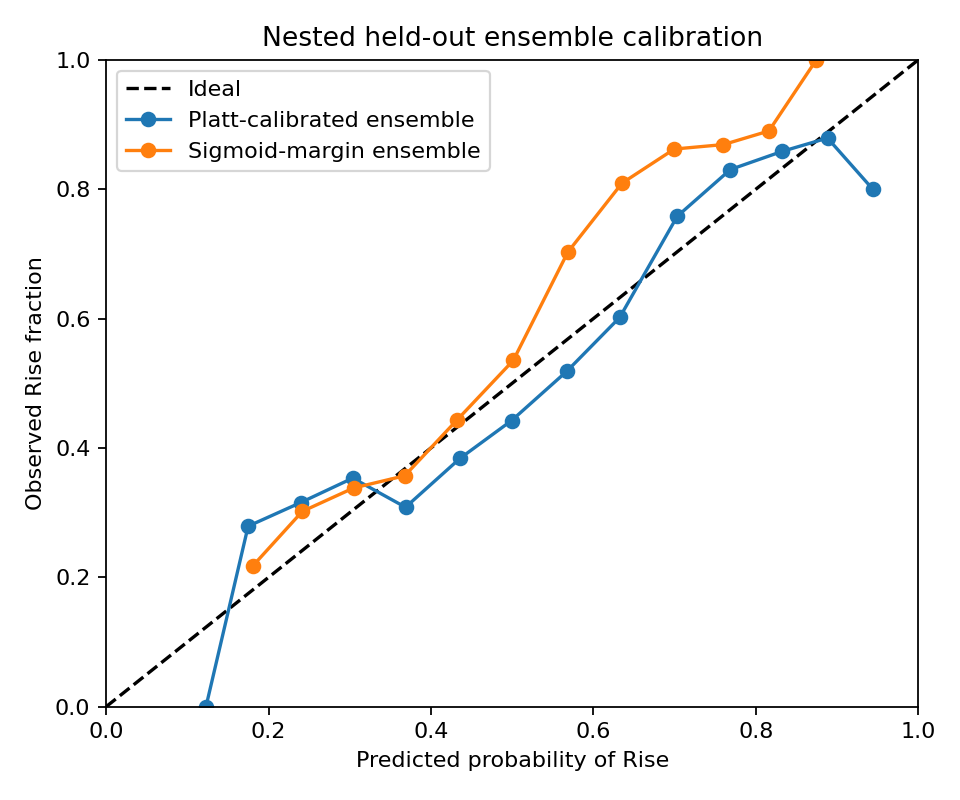

# Reliability and best-output audit

## Decision

**Final selection gate: NOT PASSED.** No new system is promoted automatically. Pooled CV is strongly azimuth-confounded, within-bin performance is near chance, and ensemble complexity requires a credible improvement. Existing CSV/checkpoint are preserved, not certified as scientifically reliable. No new final CSV was generated by this study. The existing 2,000-row submission and exact checkpoint remain unchanged. Do not confuse structural validity with demonstrated scientific reliability. The higher-scoring original metadata model is retained as a comparator, not endorsed as a robust shortcut.

## Required summary

```text
Submission structure: PASS
Estimated reliability: 71.49% balanced accuracy
95% confidence interval: 70.46%–72.52%
Conservative reliability floor: 70.46%
Class 0 recall: 74.81%
Class 1 recall: 68.18%
Worst-fold balanced accuracy: 70.34%
Worst azimuth-bin balanced accuracy: 47.68%
Ensemble unanimous agreement: 84.35%
Mean evaluation confidence: 75.80%
Actual hidden-test accuracy: Unknown until organizer evaluation
```

The main estimate now comes from **nested five-fold ensemble OOF**, rather than the earlier single-held-out-member score of 70.93%. Each outer validation row and its detected duplicate group are unseen by all five ensemble members. Each member trains on 80% of the outer training partition; its calibration/threshold uses an additional training-side grouped holdout. Final deployment members use 80% of the full training data, so this nested estimate uses a smaller training size. It remains a model-selection estimate, not a measurement of hidden-test accuracy.

## Uncertainty and bias

10,000 paired cluster-bootstrap resamples, seed 2026, stratify duplicate groups into pure-depth, pure-rise and mixed-label groups. Resampling retains all rows in a group together; group counts per stratum stay fixed while class row counts may vary. The 2.5th and 97.5th percentiles form the interval. The requested conservative floor is only this interval's lower bound, **not a guaranteed deployment floor**. It excludes refitting, model-selection uncertainty, unknown related scenes and lighting-distribution shift. All evaluated candidates, including failed baselines and fixed equal-weight ensembles, are retained below; choosing their maximum is biased.

## Classification metrics

Ordinary OOF accuracy: 70.59%. Mean fold BA: 71.49%; sample standard deviation: 0.914 percentage points. Recall gap: 6.63 percentage points. Confusion matrix (true rows / predicted columns, 0 then 1): `[[2135, 719], [1591, 3409]]`. False positives (Depth called Rise): 719; false negatives (Rise called Depth): 1591.

| Fold | BA | Accuracy | Depth recall | Rise recall | Confusion matrix |
| --- | --- | --- | --- | --- | --- |
| 1 | 71.15% | 70.83% | 72.33% | 69.97% | [[413, 158], [300, 699]] |
| 2 | 72.81% | 71.46% | 77.76% | 67.87% | [[444, 127], [321, 678]] |
| 3 | 70.34% | 69.85% | 72.15% | 68.53% | [[412, 159], [315, 686]] |
| 4 | 71.85% | 70.04% | 78.46% | 65.23% | [[448, 123], [348, 653]] |
| 5 | 71.32% | 70.76% | 73.33% | 69.30% | [[418, 152], [307, 693]] |

The primary decision rule averages member probabilities after a log-odds shift by each training-only threshold and uses 0.5. This is a decision score, not a calibrated probability. Raw calibrated-probability soft voting at the default 0.5 yields 67.11% BA. Both rules were tested without optimizing any threshold on outer OOF labels. Any advantage from choosing a voting rule on these results must still be treated as model-selection bias. An ensemble is not promoted merely because a voting rule is better than another ensemble rule.

## All matched-protocol comparisons

| Candidate | OOF BA | 95% CI | Depth recall | Rise recall | Worst fold | Worst azimuth bin |
| --- | --- | --- | --- | --- | --- | --- |
| angle-only-diagnostic | 78.14% | 77.22%–79.07% | 82.38% | 73.90% | 77.79% | 48.91% |
| existing-metadata-logistic | 75.42% | 74.45%–76.40% | 80.41% | 70.42% | 74.94% | 47.60% |
| reflect-logistic | 69.45% | 68.42%–70.49% | 76.59% | 62.30% | 68.71% | 43.25% |
| reflect-rbf-balanced | 70.93% | 69.90%–71.97% | 74.77% | 67.08% | 70.21% | 48.24% |
| reflect-rbf-unbalanced | 70.82% | 69.79%–71.86% | 71.93% | 69.70% | 69.79% | 48.39% |
| constant-image-logistic | 70.50% | 69.50%–71.51% | 75.02% | 65.98% | 68.92% | 46.51% |
| mobilenet-reflect-logistic | 62.77% | 61.67%–63.85% | 67.41% | 58.12% | 61.32% | 49.66% |
| nested-fivefold-svm | 71.49% | 70.46%–72.52% | 74.81% | 68.18% | 70.34% | 47.68% |
| raw-hog-logistic | 50.56% | 49.82%–51.32% | 22.00% | 79.12% | 49.66% | 45.84% |
| resnet-raw-logistic | 49.72% | 48.82%–50.61% | 40.22% | 59.22% | 48.56% | 44.41% |
| resnet-reflect-logistic | 65.63% | 64.58%–66.68% | 71.86% | 59.40% | 64.48% | 47.45% |
| resnet-reflect-rbf-balanced | 66.06% | 65.00%–67.10% | 74.91% | 57.20% | 65.50% | 46.71% |
| hog-resnet-soft-probability | 65.37% | 64.36%–66.41% | 45.13% | 85.62% | 64.50% | 49.34% |
| hog-resnet-training-threshold-adjusted | 71.63% | 70.61%–72.65% | 77.08% | 66.18% | 71.13% | 47.61% |
| raw-normalized-resnet-soft-probability | 51.65% | 51.19%–52.11% | 5.64% | 97.66% | 50.95% | 48.69% |
| raw-normalized-resnet-training-threshold-adjusted | 65.84% | 64.79%–66.88% | 72.04% | 59.64% | 65.12% | 48.25% |
| resnet-mobilenet-soft-probability | 55.91% | 55.10%–56.73% | 20.43% | 91.40% | 54.66% | 48.50% |
| resnet-mobilenet-training-threshold-adjusted | 66.84% | 65.81%–67.89% | 74.56% | 59.12% | 65.57% | 49.33% |
| nested-fivefold-svm-soft-probability | 67.11% | 66.07%–68.14% | 50.18% | 84.04% | 66.36% | 49.34% |

The JSON includes paired improvement intervals against the original metadata model and the single SVM, plus component comparisons for architecture ensembles. No invented composite reliability score is used. The original historical 75.38% random-stratified result used pooled-OOF threshold selection and is kept separately; its stricter matched-protocol score is shown above. Candidate folds, feature versions and group identities are shared and explicitly checked. Frozen ImageNet models do not train on competition validation labels; they are feature extractors with learned sklearn heads, not fine-tuned CNNs.

## Reliability by condition

| Azimuth | N | BA | Depth recall | Rise recall |
| --- | --- | --- | --- | --- |
| 0-45 | 693 | 47.68% | 20.73% | 74.63% |
| 45-90 | 693 | 49.11% | 7.23% | 90.98% |
| 90-135 | 722 | 51.78% | 7.53% | 96.03% |
| 135-180 | 706 | 49.16% | 1.33% | 96.99% |
| 180-225 | 712 | 49.58% | 6.41% | 92.74% |
| 225-270 | 685 | 51.83% | 30.34% | 73.32% |
| 270-315 | 1818 | 50.02% | 89.12% | 10.92% |
| 315-360 | 1825 | 50.15% | 86.90% | 13.39% |

Macro average of within-azimuth-bin BA: 49.91%. The contrast between pooled BA and near-chance within-bin BA is consistent with strong azimuth-related confounding. Solar normalization alone does not eliminate that shortcut, because rotated scene orientation and original black regions can still reveal the angle. This is not evidence of dependable physical morphology recognition.

| Condition | N | BA | Depth recall | Rise recall |
| --- | --- | --- | --- | --- |
| brightness low | 2618 | 71.74% | 75.03% | 68.45% |
| brightness medium | 2618 | 73.16% | 76.02% | 70.29% |
| brightness high | 2618 | 69.58% | 73.35% | 65.81% |
| contrast low | 2617 | 70.44% | 74.74% | 66.14% |
| contrast medium | 2619 | 71.92% | 75.99% | 67.85% |
| contrast high | 2618 | 72.08% | 73.66% | 70.50% |
| near_maximum_rotation_padding | 1751 | 72.58% | 76.73% | 68.43% |
| near_right_angle | 1687 | 66.80% | 67.79% | 65.81% |
| duplicate_group_rows | 2919 | 72.35% | 74.30% | 70.41% |
| singleton_rows | 4935 | 71.30% | 75.34% | 67.26% |
| conflicting_label_group_rows | 2917 | 72.40% | 74.30% | 70.51% |

Brightness is mean grayscale intensity and contrast is grayscale standard deviation on [0,1]. Low/medium/high use full-training empirical tertiles for descriptive slicing only, not model fitting. Rotation-boundary proxies are within 10 degrees of 45 modulo 90 (maximal new corner support) or of a multiple of 90. These are geometry proxies, not manually annotated object-boundary locations. No confirmed cross-fold leakage remains among detected groups; unrecognized scene relationships cannot be ruled out.

The raw HOG / constant-fill / reflect logistic comparisons isolate normalization and border handling at the same regularization and splits. The raw-versus-normalized ResNet comparison supplies a separate pretrained-image ablation. The rotation sign was already correct; the repair changes border handling, not the sign. Neither normalization nor reflect padding is claimed to improve robustness merely because its pooled score rises.

## Noise and interpolation sensitivity

Only separate requested diagnostic copies were perturbed; original validation/test inputs and submission predictions were never augmented. Deterministic Gaussian noise uses sigma=1 grayscale level, and the alternate rotation uses bilinear instead of bicubic interpolation. Each diagnostic is predicted only by its outer-held-out ensemble. Results and flip fractions:

| Diagnostic | BA | Prediction flip rate |
| --- | --- | --- |
| original | 71.49% | 0.00% |
| gaussian_noise_sigma_1_graylevel | 71.36% | 2.80% |
| bilinear_rotation | 71.38% | 2.27% |

## Probability calibration

Nested OOF Platt-calibrated ensemble: Brier 0.188007, log loss 0.558718, ECE 0.045611. Uncalibrated sigmoid-margin ensemble: Brier 0.198588, log loss 0.585529, ECE 0.091559. ECE uses 15 equal-width bins of positive-class probability, weighted by each bin's sample count. A sigmoid-transformed SVM margin is an explicit uncalibrated comparator, not an inherently probabilistic SVM output. Calibration is fit only on training-side held-out scores. Classification thresholds and calibration must be judged separately; better Brier score does not establish better balanced accuracy or calibration after distribution shift.

Default-0.5 uncalibrated sigmoid-margin soft voting gives 70.21% BA, versus 67.11% for calibrated soft voting. Thus better calibration does not preserve default-cutoff BA here. The threshold-adjusted deployed rule scores 71.49%, but this does not isolate calibration's causal benefit. The checkpoint is preserved for audit, not newly promoted under the calibration/selection requirement.



## Evaluation confidence and agreement (not accuracy)

Mean confidence in the submitted label: 75.80%; median 79.96%. At least 70%: 78.15%; at least 80%: 49.90%; at least 90%: 5.55%. There are 171 predictions within 0.05 of the ensemble decision cutoff. Confidence means p(Rise) for submitted Rise and 1-p(Rise) for submitted Depth; it is not always max(p,1-p), because balanced-accuracy thresholds need not be 0.5. Mean max-class probability, a different quantity, is 77.46%.

All five members agree on 84.35%; at least four agree on 94.55%. At least three agree on 100.00%, which is automatic for five binary voters and is not evidence of reliability. Average probability standard deviation: 0.036914. Changing the deployed decision rule to raw probability soft voting at 0.5 would change 192 labels; it was not applied to the submission.

Most disputed IDs: eval_00491.png, eval_01492.png, eval_00170.png, eval_00903.png, eval_01447.png, eval_01193.png, eval_00050.png, eval_00181.png, eval_01519.png, eval_01979.png, eval_00792.png, eval_01764.png, eval_01752.png, eval_00572.png, eval_00524.png, eval_00760.png, eval_00259.png, eval_01085.png, eval_01864.png, eval_01269.png.

## Efficiency and resource measurements

Existing checkpoint end-to-end inference benchmark for all 2,000 images: 63.81 seconds, 31.34 images/second; model size 48.57 MiB. Timing covers model loading, preprocessing, prediction and a feature-cache write, not process startup or final CSV writing. Sampled peak process RSS: 355.14 MiB; sampled whole-system used RAM: 12.87 GiB. CUDA was unavailable, so GPU memory is 0 and mixed precision is not applicable.

The kernel model stores 11,836,596 support-vector values and 26,664 fitted dual/intercept coefficients, plus ten sigmoid-calibration coefficients across five members. This is not a neural-network trainable-parameter count. Frozen backbone and fitted head parameter counts are recorded in the JSON for transfer candidates. Feature caches and checkpoint reuse avoid repeated image computation. Sklearn estimators converge without epoch scheduling/early stopping; no unperformed neural training, mixed precision or fine-tuning is claimed.

| Candidate | Fit + validation seconds* | Checkpoint MiB** | Sampled process peak MiB | Cached-head inference seconds |
| --- | --- | --- | --- | --- |
| angle-only-diagnostic | 20.52 | 0.00 | not measured | not measured |
| existing-metadata-logistic | 51.40 | 0.07 | not measured | not measured |
| reflect-logistic | 18.84 | 0.07 | not measured | not measured |
| reflect-rbf-balanced | 224.53 | 48.57 | not measured | not measured |
| reflect-rbf-unbalanced | 246.61 | 47.62 | not measured | not measured |
| constant-image-logistic | 39.86 | 0.07 | 313.0 | not measured |
| mobilenet-reflect-logistic | 52.71 | 0.09 | 323.9 | 0.0770 |
| nested-fivefold-svm | 1096.88 | 195.41 | 400.9 | not measured |
| raw-hog-logistic | 88.96 | 0.07 | 312.8 | not measured |
| resnet-raw-logistic | 36.06 | 0.08 | 308.2 | 0.0426 |
| resnet-reflect-logistic | 124.69 | 0.08 | 308.1 | 0.2223 |
| resnet-reflect-rbf-balanced | 606.95 | 60.84 | 441.9 | 50.9035 |

* New candidates include five-fold CV plus four held-out-sector checks. Historical entries contain only their recorded five-fold CV timer. Nested ensemble entries include all 25 member fits and their internal calibration fits. These are not directly comparable total pipeline times. Historical full training wall time and training peak RAM were not instrumented; they are explicitly unavailable rather than invented. ** Nested size is all 25 research-validation checkpoints, not the deployed five-member file; CNN entries are heads only and require the shared pretrained weights below. Cached-head latency is not end-to-end image latency.

| Deterministic feature pass | Images | Seconds | Images/second | Process peak MiB |
| --- | --- | --- | --- | --- |
| constant_hog_test_features | 2000 | 17.50 | 114.31 | 186.59 |
| mobilenet_v3_small_reflect_features | 9854 | 161.92 | 60.86 | 625.02 |
| mobilenet_v3_small_reflect_test_features | 2000 | 75.93 | 26.34 | 577.48 |
| raw_hog_test_features | 2000 | 16.52 | 121.04 | 182.36 |
| reflect_hog_test_features | 2000 | 24.74 | 80.83 | 192.98 |
| resnet18_raw_features | 9854 | 575.67 | 17.12 | 939.02 |
| resnet18_raw_test_features | 2000 | 68.15 | 29.35 | 848.32 |
| resnet18_reflect_features | 9854 | 243.33 | 40.50 | 928.72 |
| resnet18_reflect_test_features | 2000 | 225.63 | 8.86 | 844.12 |

| Classical model | Staged 2,000-image seconds | Images/second | Fitted coefficients incl. calibration |
| --- | --- | --- | --- |
| existing-metadata-logistic | 17.57 | 113.82 | 2255 |
| reflect-logistic | 24.81 | 80.60 | 2235 |
| reflect-rbf-balanced | 67.70 | 29.54 | 26674 |
| reflect-rbf-unbalanced | 57.60 | 34.72 | 26167 |
| angle-only-diagnostic | 0.04 | 52683.01 | 35 |
| raw-hog-logistic | 16.59 | 120.56 | 2235 |
| constant-image-logistic | 17.56 | 113.89 | 2235 |

These staged classical timings add separately measured preprocessing and checkpoint load/prediction. They exclude CSV export. Pretrained backbone files required in addition to learned CNN heads: mobilenet_v3_small-047dcff4.pth: 9.83 MiB, resnet18-f37072fd.pth: 44.66 MiB. Backbone parameters are frozen (zero trainable backbone parameters); linear heads learn feature-dimension + 1 coefficients per member, plus two calibration coefficients. Kernel heads store support vectors and dual coefficients rather than a neural parameter count. Fixed architecture ensembles reuse these component resources; their complete joint pipeline was not separately benchmarked.

The dedicated 2,000-image passes measure feature-extraction latency without classifier fitting. Add the recorded head inference stage to estimate the corresponding staged pipeline duration; model construction, startup and CSV export are excluded. Timers were collected while other experiments could run, so they are device-session measurements, not controlled hardware benchmarks. Peak system RAM includes other applications and is sampled every 0.1 second rather than a guaranteed instantaneous maximum. No measured value is substituted for an unrecorded historical measurement.

The resumed ResNet/SVM run combines its saved CV duration with newly timed sector checks. Its saved peak memory covers only the resumed stage, not the interrupted earlier CV stage. This narrower coverage is also marked in the JSON. Raw/normalized CNN timing differences under concurrent load should not be interpreted as intrinsic architecture speed differences.

Official architecture/preprocessing references: [ResNet-18](https://docs.pytorch.org/vision/stable/models/generated/torchvision.models.resnet18.html) and [MobileNetV3-Small](https://docs.pytorch.org/vision/stable/models/generated/torchvision.models.mobilenet_v3_small.html). Runs used torch 2.12.0+cpu and torchvision 0.27.0+cpu with verified ImageNet V1 weights and deterministic 224-pixel center crops after required normalization.

The core competition training/inference environment was isolated and its nine tests pass. The extended research environment reused system-site CPU PyTorch and was not clean-isolated. Its dependency check reported unrelated inherited arxiv/requests, pyiceberg/rich and realtime/websockets conflicts, detailed in the JSON. These packages are not used by the competition scripts, and the research runs completed, but a clean extended-environment reproduction has not been demonstrated. No global dependencies were changed to hide these conflicts.

## Deliverables and remaining qualification

`reliability_metrics.json` contains measured candidate metrics, confidence intervals, conditions, resource details and the selection gate. The primary saved OOF table is nested ensemble OOF; evaluation probabilities come from the unchanged actual inference checkpoint. Structural validity is independently checked against test metadata. Actual hidden-test accuracy remains unknown until organizer evaluation. The existing public weights action remains manual at the user's request. No form or LinkedIn post was submitted.
